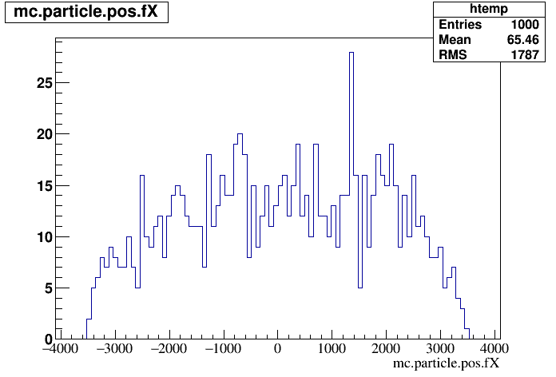

Installation
------------
Prerequisites
`````````````
These software packages should be installed in the order presented before you attempt to build RAT.  Take note of the version numbers as many of these packages make incompatible changes between releases.

 * `Python with development headers <https://www.python.org/>`_ - Using common package managers, type

    - on Scientific Linux: ``sudo yum install python-devel``
    - on Ubuntu: . . . . . . ``sudo apt-get install python-dev``
    - on SUSE Linux: . . . ``sudo zypper install python-devel``


 * `ROOT 5.34 <http://root.cern.ch/drupal/content/downloading-root>`_ - Used for object serialization and network processors. (other versions of ROOT 5 are okay too).  RAT-PAC requires the python development libraries thus when configuring the root make use the ``--enable-python option`` i.e.
    - ``./configure --enable-python``

 * `GEANT4 9.6.p03 <http://geant4.web.cern.ch/geant4/support/download.shtml>`_ `tar file <http://geant4.cern.ch/support/source/geant4.9.6.p03.tar.gz>`_- Toolkit used by the Monte Carlo simulation.  When running ``cmake`` to configure GEANT4, be sure to use ``-DGEANT4_INSTALL_DATA=ON`` to download the interaction cross-section files (or download them manually).

     :For begining GEANT4 users:  In the directory you want to install Geant4 (referenced as ``[InstallDir]`` below), type the following commands
  
      - ``DIR=$( cd "$( dirname "${BASH_SOURCE[0]}" )" && pwd )``
      - ``wget http://geant4.cern.ch/support/source/geant4.9.6.p03.tar.gz``
      - ``tar -zxvf geant4.9.6.p03.tar.gz``
      - ``mkdir $DIR/geant4.9.6.p03-build``
      - ``cd geant4.9.6.p03-build``
      - ``cmake -DCMAKE_INSTALL_PREFIX=$DIR/geant4.9.6.p03-build $DIR/geant4.9.6.p03 -DGEANT4_USE_SYSTEM_EXPAT=OFF -DGEANT4_INSTALL_DATA=ON -DGEANT4_BUILD_MULTITHREADED=ON -DGEANT4_USE_QT=ON``
      - ``make -j1``
      - ``make install``
      - ``cd ..``
      - ``mkdir envSetupScripts``
      - ``cp $DIR/geant4.9.6.p03-build/InstallTreeFiles/geant4.sh ./envSetupScripts``
      - ``cp $DIR/geant4.9.6.p03-build/InstallTreeFiles/geant4make.sh ./envSetupScripts``
      - ``cp $DIR/geant4.9.6.p03-build/InstallTreeFiles/geant4.csh ./envSetupScripts``
      - ``cp $DIR/geant4.9.6.p03-build/InstallTreeFiles/geant4make.csh ./envSetupScripts``

     The enviroment variable files referenced below will be located in [InstallDir]/envSetupScripts

 * `SCons <http://www.scons.org/doc/2.1.0/HTML/scons-user/x121.html>`_ - Using common package managers, type

    - on Scientific Linux: ``sudo yum install scons``
    - on Ubuntu: . . . . . . ``sudo apt-get install scons``

Build Steps
```````````

 * Make sure that you have setup your environment variables:

   Source the GEANT4 enviroment variable files
    - for bash shell ``geant4.sh``
    - for C shell ``geant4.csh``

   Source the GEANT4 enviroment variable files
    - for bash shell ``thisroot.sh``
    - for C shell ``thisroot.csh``

   If you do not know where to find these files, type
    - ``locate [fileName]``

   Replacing [fileName] with the file you wish to locate.  If the file path does not appear, type
    - ``sudo updatedb``  #  ``sudo updatedb`` may require an administrator to run

 * Download RAT from GitHub
    Move to the directory you wish to install rat-pac in [rat-pacWorkingDIR] hinceforth.
    For Anonymous Users type
    
    - ``git clone https://github.com/rat-pac/rat-pac``

    For Developers type
    
    - ``git clone git@github.com:rat-pac/rat-pac``


 * Build rat-pac
   Starting from [rat-pacWorkingDIR] type

    - ``cd rat-pac``
    - ``./configure``

   Source the newly generated rat-pac enviroment variable files :Note: You will also need to source this file in the future before running rat-pac.
    - for bash shell type ``env.sh``
    - for C shell type ``env.csh``

   

   Build the rat-pac development package by typing
    - ``scons``


Test Drive
``````````

 *  Run an interactive session by typing
     - ``rat``

       Here's a sample of what you might see (type ``exit`` to exit the interactive rat-pac terminal)::

          RAT, version c8164f1
          Status messages enabled: info 
          Hostname: wrangler.phys.vt.edu PID: 31590
          DB: Loading /rat-pac-working-dir/rat-pac/data/DAQ.ratdb ... Success!
          DB: Loading /rat-pac-working-dir/rat-pac/data/DETECTOR.ratdb ... Success!
          DB: Loading /rat-pac-working-dir/rat-pac/data/ELEMENTS.ratdb ... Success!
          DB: Loading /rat-pac-working-dir/rat-pac/data/IBD.ratdb ... Success!
          DB: Loading /rat-pac-working-dir/rat-pac/data/IO.ratdb ... Success!
          DB: Loading /rat-pac-working-dir/rat-pac/data/MATERIALS.ratdb ... Success!
          DB: Loading /rat-pac-working-dir/rat-pac/data/MC.ratdb ... Success!
          DB: Loading /rat-pac-working-dir/rat-pac/data/NOISE.ratdb ... Success!
          DB: Loading /rat-pac-working-dir/rat-pac/data/NTUPLE.ratdb ... Success!
          DB: Loading /rat-pac-working-dir/rat-pac/data/OPTICS.ratdb ... Success!
          DB: Loading /rat-pac-working-dir/rat-pac/data/PMT.ratdb ... Success!
          DB: Loading /rat-pac-working-dir/rat-pac/data/PMTCHARGE.ratdb ... Success!
          DB: Loading /rat-pac-working-dir/rat-pac/data/PMTTRANSIT.ratdb ... Success!
          DB: Loading /rat-pac-working-dir/rat-pac/data/RUN.ratdb ... Success!
          DB: Loading /rat-pac-working-dir/rat-pac/data/SPECTRUM.ratdb ... Success!
          DB: Loading /rat-pac-working-dir/rat/rat/data/PMTTRANSIT.ratdb ... Success!
          
          *************************************************************
           Geant4 version Name: geant4-08-01-patch-01    (27-July-2006)
                                Copyright : Geant4 Collaboration
                                Reference : NIM A 506 (2003), 250-303
                                      WWW : http://cern.ch/geant4
          *************************************************************
          
          Visualization Manager instantiating...
          Visualization Manager initialising...
          Registering graphics systems...
          Visualization Manager initialising...
          Registering graphics systems...
          
          You have successfully registered the following graphics systems.
          Current available graphics systems are:
            ASCIITree (ATree)
            DAWNFILE (DAWNFILE)
            G4HepRep (HepRepXML)
            G4HepRepFile (HepRepFile)
            OpenGLImmediateQt (OGLIQt)
            OpenGLStoredQt (OGLSQt)
            RayTracer (RayTracer)
            VRML1FILE (VRML1FILE)
            VRML2FILE (VRML2FILE)
        
          Registering model factories...
          
          You have successfully registered the following model factories.
          Registered model factories:
            generic
            drawByCharge
            drawByParticleID
            drawByOriginVolume
            drawByAttribute
          
          Registered filter factories:
            chargeFilter
            particleFilter
            originVolumeFilter
            attributeFilter
          
          You have successfully registered the following user vis actions.
          Run Duration User Vis Actions: none
          End of Event User Vis Actions: none
          End of Run User Vis Actions: none
          
          Some /vis commands (optionally) take a string to specify colour.
          Available colours:
            black, blue, brown, cyan, gray, green, grey, magenta, red, white, yellow
          
          Available UI session types: [ Qt, GAG, tcsh, csh ]
          ***** Can not open a macro file <prerun.mac>
          PreInit> 

 * Run a macro example job by typing 

    - ``rat mac/electron_demo_cylinder.mac -o test.root``

    This will simulate 1000 -- 10 MeV electrons in a cylindrical detector. 

 * Now you can start ROOT to analyze the events you just created by typing

    - ``root test.root``
    - ``T->Draw("mc.particle.pos.fX")``

You should get a plot of particle x coordinates similar to the plot below.

|RootOutputTutorial000|



:Note: that with the RAT environment sourced, you are getting a special copy of ROOT that automatically loads the RAT ROOT event library.
report errors to Derek Rountree -- rountree@vt.edu
page update Feb. 24 2015
